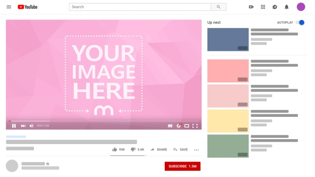

# Project Name

Youtube Player Page Replica

HTML & CSS Youtube PLayer Page Replica

## Built With

- HTML,
- CSS

## Live Demo

[Live Demo Link](https://safaerden.github.io/Youtube-Player-Page-Replica/)

## Getting Started

To get a local copy up and running follow these simple example steps.

### Pre-Requisites
localhost or a web hosting

### Setup
Just download the files & upload it to your folder

### Usage
Youtube Player Page Replica (Layout)

## Authors

👤 **Hatem Sweileh**

- Github: [@hatemswaileh](https://github.com/hatemswaileh/)
- Twitter: [@hatemswaileh](https://twitter.com/hatemswaileh)
- Linkedin: [linkedin](https://www.linkedin.com/in/HatemSwaileh)

👤 **Safa Erden**

- Github: [@safaerden](https://github.com/SafaErden)
- Twitter: [@safaerden](https://twitter.com/safaerden)
- Linkedin: [linkedin](https://www.linkedin.com/in/SafaErden/)

## 🤝 Contributing

Contributions, issues and feature requests are welcome!

Feel free to check the [issues page](https://github.com/SafaErden/Youtube-Player-Page-Replica/issues).

## Show your support

Give a ⭐️ if you like this project!

## 📝 Acknowledgments

- If you are applying issues please just use HTML & CSS
- Please keep in mind that this project is just a not fully functional Layout for Youtube Player Page
